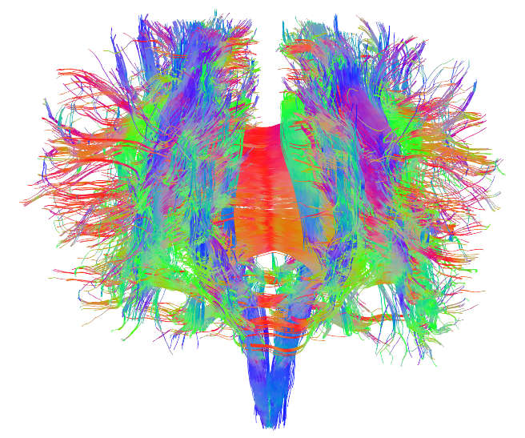

```{r setup, include=FALSE, cache=FALSE}
options(htmltools.dir.version = FALSE)
```

```{r, eval=FALSE, echo=FALSE, cache=FALSE}
rmarkdown::render("./slides/index.Rmd")
xaringan::inf_mr('./index.Rmd')
xaringan::inf_mr()
```

class: inverse, center, middle

# Introducción

---

# La fonética... asunto de vida y muerte

</br>

<div align='center'>
<video width="320" height="240" controls>
  <source src="./assets/video/why.mpg" type="video/mpg">
  <source src="./assets/video/why.ogg" type="video/ogg">
Your browser does not support the video tag.
</video>
</div>

---
background-image: url("./assets/img/puente.jpg")
background-size: 250px
background-position: 85%, 35%

# La fonética... asunto de vida y muerte

### Joven holandesa muere tras malentendido lingüístico<sup>1<sup>

- 17 años
- Participaba en un campamento de surf en Cantabria, España 
- Decidieron hacer "puenting"

--

#### «uno de los responsables de Aqua 21 le dijo a Vera:  
#### 'OK, cuando sea el momento de saltar. No te preocupes y salta'.  
#### Y en ese momento la chica saltó, pero la cuerda no estaba  
#### asegurada al puente.»

.footnote[
[1] [El Diario Montañés](http://www.eldiariomontanes.es/cantabria/201508/14/buena-estudiante-chica-mucho-20150814000057-v.html)]

---
class: inverse, middle
background-image: url("./assets/img/vera.jpg")
background-size: 250px
background-position: 85%, 35%

### "No jump, it’s important, no jump" (No saltar, es importante, 
### no saltar), dijo en inglés, de acuerdo con documentos de la 
### corte. Pero Mol, aparentemente no entendió su pronunciación y 
### escuchó: “Now jump” (Salta ahora). Ella se lanzó y se 
### precipitó hacia su muerte. El arnés que portaba todavía no 
### había sido asegurado al puente.

.footnote[
[1] [NY times](https://www.nytimes.com/2017/06/28/world/europe/bungee-jump-death-spain.html?mc=adglobal&mcid=facebook&mccr=intl&subid=MC14&ad-keywords=IntlAudDev&subid1=TAFI)
]

---

# Introducciones

### ¿Quién soy?

--

<div style="float:right">
  
</div>

### ¿Quiénes sois?

- ¿Qué nivel enseñan?

- ¿Se incluye la pronunciación en sus clases? ¿Cómo?

- ¿Se incluye la pronunciación en los libros de texto? ¿Cómo?

- ¿Es importante estudiar/practicar la pronunciación? ¿Por qué?

---

# El estado de la cuestión

### **Acuerdo general**: la pronunciación es importante

--

### **Problema**: La fonética no se ha tenido como factor importante en las clases de lengua hasta hace relativamente poco 

--

- ¿Por qué?
  - Hay clases especializadas (ej. fonética)
  - No es importante (gramática, escritura, cultura)
  - Acceso limitado ($, tiempo)
  - Falta de conocimiento

---
background-image: url("./assets/img/happy.jpg")
background-size: 300px
background-position: 90% 20%

# El estado de la cuestión

### El panorama actual

- Hay cada vez más libros que incluyen ejercicios fonéticos

- Formación profesional incluye componentes lingüísticos  
(¿obligatorios?)

---
class: inverse, middle
background-image: url("./assets/img/complexity1.gif")
background-size: 600px
background-position: 80% 25%

## El objetivo del maestro
## es **simplificar**

### (no es una clase de fonética)

---
class: inverse, middle

<div align="center">
  <iframe src="https://www.facebook.com/plugins/video.php?href=https%3A%2F%2Fwww.facebook.com%2Fnadinelavan%2Fvideos%2F10153716278513917%2F&show_text=0&width=560" width="560" height="315" style="border:none;overflow:hidden" scrolling="no" frameborder="0" allowTransparency="true" allowFullScreen="true"></iframe>
</div>

---
class: inverse, middle
background-image: url("./assets/img/birds.gif")
background-size: 400px
background-position: 90% 50%

# **El objetivo de este taller**

### Dar ejemplos de cómo podemos simplificar los problemas 
### que presenta el español

### Ofrecer algunos ejercicios simplificados 


---
class: inverse, middle
background-image: url("./assets/img/confundido.png")
background-size: 400px
background-position: 85%, 30%

# Un poco de teoría

---

# Aprender una L2 es difícil

<div style="float:right">
  
  
</div>

- El bilingüismo secuencial tiene consecuencias fonéticas (<grey>e.g. Flege et al., 1997; Pallier et al., 1997; Sebastián-Gallés & Soto-Faraco, 1999; entre muchos </grey>)

--

- El acento extranjero suele mantenerse, incluso después de muchos años de experiencia con la L2 (<grey>Bosch & Sebastián-Gallés, 2003; Kuhl et al., 1992; Werker & Tees, 1984</grey>)

--

- **Cuánto antes se aprende mejor**

---

# Aprender una L2 es difícil

<div style="float:right">
  
  
</div>

### El aprendiz tardío

- Investigaciones sobre interferencias cros-lingüísticas sugieren que la adquisición nativa es difícil/poco común

- En producción y percepción

- Incluso para bilingües secuenciales tempranos

--

- Pinta mal para el aprendiz tardío si la meta es tener producción/percepción nativa (hay excepciones)

---

# Aprender una L2 es difícil

<div style="float:right">
  
  
</div>

### Excepciones...

- Algunos aprendices tardíos sí logran producir/percibir su L2 al nivel del nativo en algunos aspectos (<grey>Bongaerts, 1999</grey>)

--

- Varios factores parecen estar correlacionados con un dominio nativo de la L2 (<grey>Bongaerts, 1999</grey>)
	- Estar expuesto a input nativo
	- Motivación
	- Entrenamiento fonético/perceptual

--

- Las investigaciones de Flege sugieren que el dominio nativo se asocia con...
	- AOA, AOL, LOR
	- Acceso a input nativo
	- **L1**/**L2 use**

---

# SLM<sup>1</sup>, L2LP<sup>2</sup>

<div style="float:right">
  
  
</div>

- La mayoría de los modelos actuales proponen que la capacidad de aprender la fonología de una L2 se mantiene durante toda la vida.

--

- Los sonidos (L1/L2) coexisten en un espacio común, por lo que hay interacciones entre ellos.

--

- Hay una conexión fuerte entre la percepción del habla y la producción. 

--

- Ciertos segmentos se consideran más o menos difícil según...
	1. la distancia acústica entre los segmentos (SLM)
	2. la relación fonológica entre la L1 y la L2 (L2LP)

- Ej. /i-ɪ/

.footnote[
[1] *Speech Learning Model*, Flege (1995)  
[2] *L2 Linguistic Perception Model*, Escudero (2005)
]

---
background-color: grey
background-image: url("./assets/img/sheep1.jpg")
background-size: contain

---
background-color: grey
background-image: url("./assets/img/ship1.jpg")
background-size: contain

---
background-image: url("./assets/img/pam1.png")
background-size: contain

---
background-image: url("./assets/img/pam2.png")
background-size: contain

---
background-image: url("./assets/img/pam3.png")
background-size: contain

---
background-image: url("./assets/img/pam4.png")
background-size: contain

---
background-image: url("./assets/img/pam5.png")
background-size: contain

---


class: inverse, middle
background-image: url("./assets/img/frustracion.jpg")
background-size: 400px
background-position: 85%, 30%

# Los problemas del español

---

# Los problemas del español

.left-column[

### <BLUE>Segmentales</BLUE>

**Las vocales**  
Las consonantes

### Suprasegmentales

La prosodia  
Estructura silábica

### ¿Más?

]

.right-column[

- Tamaño del inventorio
- Reducción (schwa)
- Diptongación

]

---

VOCALES

---

# Los problemas del español

.left-column[

### <BLUE>Segmentales</BLUE>

Las vocales  
**Las consonantes**

### Suprasegmentales

La prosodia  
Estructura silábica

### ¿Más? 

]

.right-column[

- **Las oclusivas**
	- **tiempo de inicio de sonoridad**
	- **punto de articulación**
	- espirantización
	- 'b' vs. 'v'
- Las fricativas
	- sonorización de /s/
	- aspiración
	- desafricación
- Las líquidas
	- la /l/ oscura
	- /ɾ, r/

]

---

# Los problemas del español

.left-column[

### Segmentales

Las vocales  
Las consonantes

### <blue>Suprasegmentales</blue>

**La prosodia**  
Estructura silábica

### ¿Más? 

]

.right-column[

- Ritmo
- Acento 

]

---

# Los problemas del español

.left-column[

### Segmentales

Las vocales  
Las consonantes

### <blue>Suprasegmentales</blue>

La prosodia  
**Estructura silábica**

### ¿Más?

]

.right-column[

- Resilabificación 
- Grupos consonánticos

]

---


# Los problemas del español

.left-column[

### Segmentales

Las vocales  
Las consonantes

### Suprasegmentales

La prosodia  
Estructura silábica

### <blue>¿Más?</blue>

]

---
background-image: url(./assets/img/companero1.gif)
background-size: 350 px
background-position: 85% 20%

# Los problemas del español

### Agobiante para el maestro

--

- ¿Qué incorporamos en la clase?

--

- ¿Cómo lo hacemos?

--

- ¿Expectativas realistas?

--

- ¿**Quién (no) puede enseñar fonética**?

---


class: inverse, middle
background-image: url("./assets/img/learn.jpg")
background-size: 400px
background-position: 85%, 30%

# La clínica de pronunciación 

---
class: inverse, middle
background-image: url("./assets/img/learnMidd2.gif")
background-size: 400px
background-position: 85%, 30%

# La clínica de pronunciación 

---

# La clínica de pronunciación 

### Orígenes

- No sé

--

- Armin Schwegler

--

### Propósito

- "Extraer el acento extranjero"

- Dar a conocer las dificultades específicas relacionadas con el español

- Aportar herramientas para que el estudiante practique

- Reducir el miedo

---

# La clínica de pronunciación 

### ¿Cómo?

- Simiplificar problemas fonéticos, presentándolos como "enemigos" a los que el estudiante se tiene que enfrentar

--

### En Middlebury...

- Se presenta un 'enemigo' cada semana
- Sesiones cortas (45 minutos)
	- identificación/presentación del 'enemigo'
	- ejemplos del 'enemigo'
	- posibles soluciones
	- práctica (en grupos e individualmente)

---


class: inverse, middle
background-image: url("./assets/img/learn.jpg")
background-size: 400px
background-position: 85%, 30%

# Un ejemplo... 

# Las oclusivas y el VOT

---

# Un ejemplo... Las oclusivas y el VOT

## ¿Qué es VOT?

## ¿Cómo se manifiesta en inglés y español?

---

# Un ejemplo... Las oclusivas y el VOT

## ¿Cómo podemos simplificar el problema?

## ¿Cómo podemos practicarlo?

---


class: inverse, middle
background-image: url("./assets/img/learn.jpg")
background-size: 400px
background-position: 85%, 30%

# Un ejemplo de la clínica...

---
class: inverse, middle
background-image: url("./assets/img/ex1.png")
background-size: contain

---
class: inverse, middle
background-image: url("./assets/img/ex2.png")
background-size: contain

---
class: inverse, middle
background-image: url("./assets/img/ex3.png")
background-size: contain

---
class: inverse, middle
background-image: url("./assets/img/ex4.png")
background-size: contain

---
class: inverse, middle
background-image: url("./assets/img/ex5.png")
background-size: contain

---
class: inverse, middle
background-image: url("./assets/img/ex6.png")
background-size: contain

---
class: inverse, middle
background-image: url("./assets/img/ex7.png")
background-size: contain

---
class: inverse, middle
background-image: url("./assets/img/ex8.png")
background-size: contain

---
class: inverse, middle
background-image: url("./assets/img/ex9.png")
background-size: contain

---
class: inverse, middle
background-image: url("./assets/img/ex10.png")
background-size: contain

---
class: inverse, middle
background-image: url("./assets/img/ex11.png")
background-size: contain

---
class: inverse, middle
background-image: url("./assets/img/ex12.png")
background-size: contain

---
class: inverse, middle
background-image: url("./assets/img/ex13.png")
background-size: contain

---
class: inverse, middle
background-image: url("./assets/img/ex14.png")
background-size: contain

---
class: inverse, middle
background-image: url("./assets/img/ex15.png")
background-size: contain

---
class: inverse, middle
background-image: url("./assets/img/ex16.png")
background-size: contain

---
class: inverse, middle
background-image: url("./assets/img/ex17.png")
background-size: contain

---
class: inverse, middle

# **¿Y el punto de articulación?**

---
class: inverse, middle
background-image: url("./assets/img/ex18.png")
background-size: contain

---
class: inverse, middle
background-image: url("./assets/img/ex19.png")
background-size: contain

---
class: inverse, middle
background-image: url("./assets/img/ex20.png")
background-size: contain

---
class: inverse, middle
background-image: url("./assets/img/ex21.png")
background-size: contain

---
class: inverse, middle
background-image: url("./assets/img/ex22.png")
background-size: contain

---
class: inverse, middle
background-image: url("./assets/img/ex23.png")
background-size: contain

---
class: inverse, middle
background-image: url("./assets/img/ex24.png")
background-size: contain

---
class: inverse, middle
background-image: url("./assets/img/ex25.png")
background-size: contain

---
class: inverse, middle
background-image: url("./assets/img/ex26.png")
background-size: contain

---


class: inverse, middle
background-image: url("./assets/img/learn.jpg")
background-size: 400px
background-position: 85%, 30%

# ¿Funciona?

---

```{r, echo=FALSE, warning=FALSE,cache=FALSE,results='asis'}
cat('<iframe src="./assets/figs/prodAll.html" width=100% height=100% allowtransparency="true" frameborder=0> </iframe>')
```

---

```{r, echo=FALSE, warning=FALSE,cache=FALSE,results='asis'}
cat('<iframe src="./assets/figs/prodAllD.html" width=100% height=100% allowtransparency="true" frameborder=0> </iframe>')
```

---


class: inverse, middle
background-image: url("./assets/img/learn.jpg")
background-size: 400px
background-position: 85%, 30%

# Ejercicios... 

# e ideas para implementarlos

---

# Ejercicios

### En mis clases...

- trabajos prácticos
- futuros maestros, futuros lingüistas

--

### En vuestras clases...

- Sesiones más cortas
- Actividades de precalentamiento
- Presentaciones en grupo
- Tecnología

---

# Actividad

- Desarrollar ideas/actividades para simplificar problemas fonéticos

- Averiguar cómo presentar el problema y la actividad en un tiempo reducido para poder incluir en clase

---

<iframe src="https://dood.al/pinktrombone/"></iframe>

---
class: inverse, center
background-image: url("./assets/img/0_middlebury_seal.png")
background-size: 47px
background-position: 50% 90%

</br></br>

# **¡Gracias!**  

# 🗣🎤🎧  

Joseph V. Casillas  
(joseph.casillas@rutgers.edu)  


### Presentación disponible en [github](http://www.jvcasillas.com/LSRL_2017/slides/html/index.html)


PPTs antinguas de la clínica [aquí](www.jvcasillas.com)  

PPTs nuevas disponibles [aquí](www.jvcasillas.com) al final del verano 

---
background-color: Gainsboro

# Bibliografía


```{r, eval=TRUE, echo=FALSE, cache=FALSE}
library(RefManageR)
bib <- ReadBib("./assets/bib/pronunciacion.bib", check = FALSE)
```


```{r, results='asis', echo=FALSE, eval=TRUE, cache=FALSE}
ui <- "- "
space <- " "

writeLines(ui); print(bib[key = "bowen1972contextualizing"], 
  .opts = list(check.entries = FALSE, 
               style = "markdown", 
               bib.style = "authoryear")); writeLines(space)

writeLines(ui); print(bib[key = "broughton2002teaching"], 
  .opts = list(check.entries = FALSE, 
               style = "markdown", 
               bib.style = "authoryear")); writeLines(space)

writeLines(ui); print(bib[key = "chomsky1968sound"], 
  .opts = list(check.entries = FALSE, 
               style = "markdown", 
               bib.style = "authoryear")); writeLines(space)

writeLines(ui); print(bib[key = "cook2013second"], 
  .opts = list(check.entries = FALSE, 
               style = "markdown", 
               bib.style = "authoryear")); writeLines(space)

writeLines(ui); print(bib[key = "gorjian2013using"], 
  .opts = list(check.entries = FALSE, 
               style = "markdown", 
               bib.style = "authoryear")); writeLines(space)

writeLines(ui); print(bib[key = "jones1997beyond"], 
  .opts = list(check.entries = FALSE, 
               style = "markdown", 
               bib.style = "authoryear")); writeLines(space)

writeLines(ui); print(bib[key = "pennington1986pronunciation"], 
  .opts = list(check.entries = FALSE, 
               style = "markdown", 
               bib.style = "authoryear")); writeLines(space)

writeLines(ui); print(bib[key = "prator1971phonetics"], 
  .opts = list(check.entries = FALSE, 
               style = "markdown", 
               bib.style = "authoryear")); writeLines(space)

writeLines(ui); print(bib[key = "prensky2001digital"], 
  .opts = list(check.entries = FALSE, 
               style = "markdown", 
               bib.style = "authoryear")); writeLines(space)
```